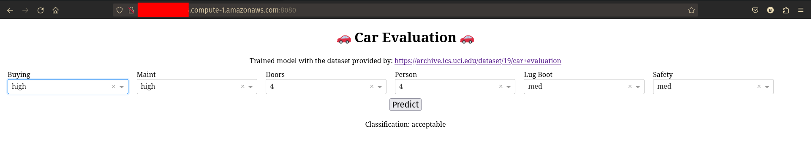
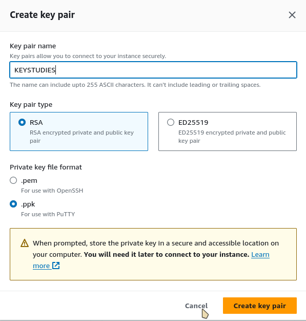
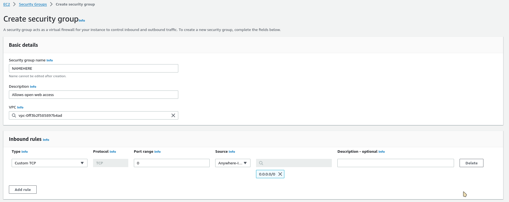
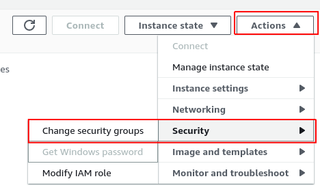
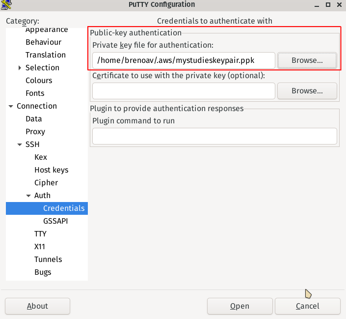
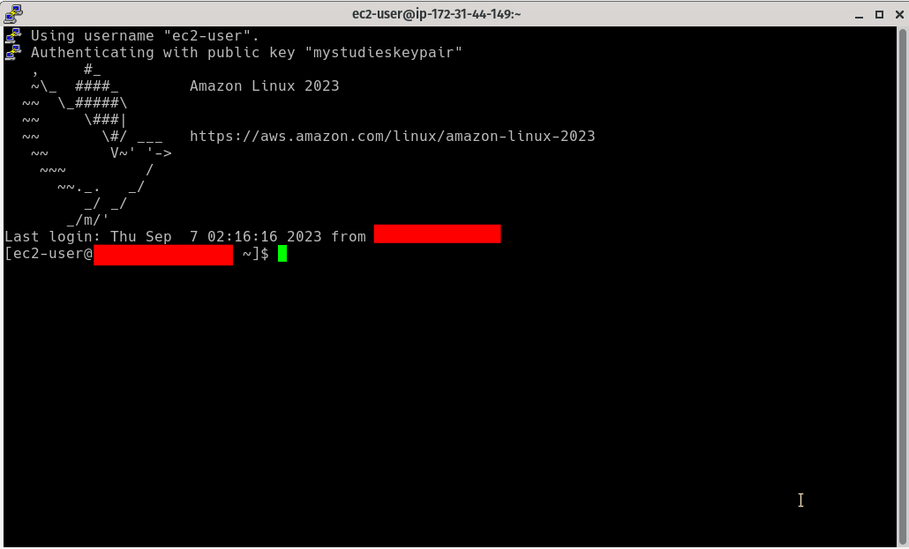
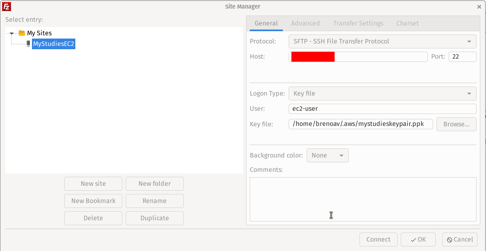
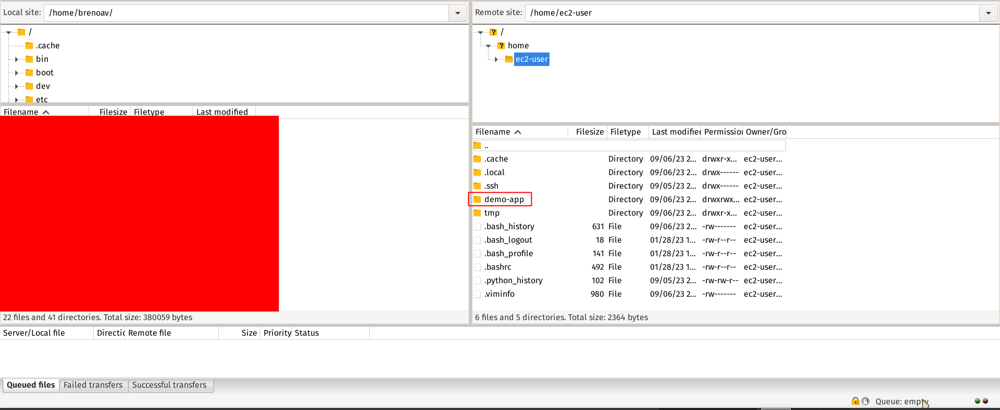
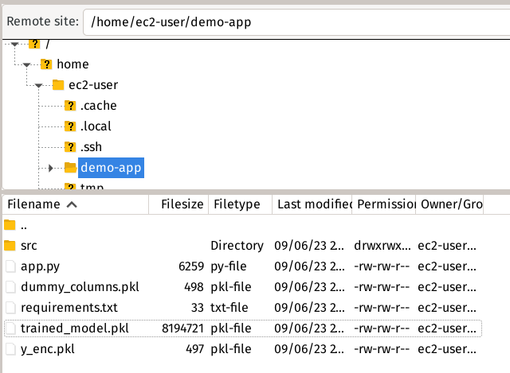
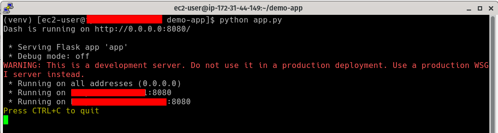

# EC2 Application ML Demo

- [EC2 Application ML Demo](#ec2-application-ml-demo)
- [Running Locally to generate the weights and encoders](#running-locally-to-generate-the-weights-and-encoders)
  - [Python Environment](#python-environment)
  - [Train the model and generate the files used in the application](#train-the-model-and-generate-the-files-used-in-the-application)
  - [Running application (locally)](#running-application-locally)
- [Run application on the open web (AWS)](#run-application-on-the-open-web-aws)
  - [Minor change on the `app.py`](#minor-change-on-the-apppy)
  - [EC2 – Instance](#ec2--instance)
  - [Security Group](#security-group)
  - [Connecting with your virtual server machine](#connecting-with-your-virtual-server-machine)
    - [PuTTY](#putty)
    - [FileZilla (or WinSCP)](#filezilla-or-winscp)
  - [Installing dependencies on EC2](#installing-dependencies-on-ec2)
  - [Running the Application](#running-the-application)
  - [Open the web application](#open-the-web-application)


A simple machine learning application hosted on EC2 (AWS).



# Running Locally to generate the weights and encoders

## Python Environment

- Create the environment using [virtualenv](https://docs.python.org/3/library/venv.html)

```bash
$ python3 -m venv venv
```
- The next step is, of course, to activate the environment and install the dependencies:

```bash
$ source venv/bin/activate # unix
$ pip install -r requirements.txt
```

## Train the model and generate the files used in the application

Now, you can run the script [train.py](train.py) without problem:

```bash
$ python train.py
```

This will generate three important files for the `Dash Application` in the root of the project folder:

```
EC2-APPLICATION-ML-DEMO/
├─ ...
├─ dummy_columns.pkl
├─ trained_model.pkl
├─ y_enc.pkl
├─ ...
```

## Running application (locally)

After generating the trained model and auxiliary files, you need to run the [app.py](app.py)

```bash
$ python app.py
```

Type in your browser the generated link: `localhost:8050` and you be able to see the application on the web.

# Run application on the open web (AWS)

## Minor change on the `app.py`

**IMPORTANT:** Go to the [app.py](app.py) and make the following changes (you just need to uncomment and comment):

```python
# CODE HERE

if __name__ == "__main__":
    app.run_server(debug=False, host="0.0.0.0", port=8080)
    # app.run(debug=True)
```

This is required before upload to the EC2 Storage (you can change after inside the PuTTY using `vi` or `vim`).

## EC2 – Instance

First, you need to create an instance on [EC2](https://aws.amazon.com/pt/ec2/) (Elastic Compute Cloud). I'm using the free tier for avoiding costs on my credit card ([Amazon Linux 2023 AMI 2023.1.20230825.0 x86_64 HVM kernel-6.1](https://docs.aws.amazon.com/pt_br/linux/al2022/release-notes/relnotes-2023.1.20230825.html)). I selected on `Instance Type`: `t2.micro` (Family: t2 - 1vCPU - 1GB Memory).

On the `Key pair name` click on `Create new key pair` if you don't have one and select the following options:



Finally, click on `Launch instance` and wait until the instance starts.

## Security Group

Open `EC2 - Security Groups` &rarr; `Create security group` &rarr; `Inbound rules` &rarr; `Add rule`:



After create the security group before, go to your instance of EC2 and manage the security groups to add the new security group policy:



On `Associated security groups` select your new security group and click on `Add security group` &rarr; `Save`

## Connecting with your virtual server machine

I'm using two software programs here for establishing the connection with the EC2 Instance:

1. [PuTTY](https://www.putty.org/) - Connect to an SSH server
2. [FileZilla](https://filezilla-project.org/) - Download and upload files via FTP, FTPS and SFTP. If you use [Windows](https://www.microsoft.com/en-us/windows) you can use [WinSCP](https://winscp.net/eng/download.php)

### PuTTY

1. Session:

```
Host Name (or IP address): ec2-user@<Your Public IPv4 address>
Port: 22
Connection type: SSH (Telnet)
```

2. Connection &rarr; SSH &rarr; Credentials

Load your credentials (Key-Pair) created and **storage outside your code**



And click on `Open` to establish the connection with the EC2 Instance.



### FileZilla (or WinSCP)

We'll use this to transfer files more easily with the EC2. Go to `File` &rarr; `Site Manager` and fill as shown below:



On `Host`, you put your Public IPv4 address used on the PuTTY. Click on `Connect` and if everything works well, you can see the files from the EC2



Now, let's go transfer our files to the EC2 instance. I created a folder called: `demo-app/` using the FileZilla as you can see by the figure above.

You'll go to the file manager and transfer the following files and folders: `src/`, `app.py`, `dummy_columns.pkl`, `requirements.txt`, `trained_model.py`, and `y_enc.pkl`. You'll have something like this:



## Installing dependencies on EC2

- Go back to the terminal PuTTY, and enter in your folder `demo-app` (`$ cd demo-app`)
- Run the commands to create the virtual environment and then activate the environment

```bash
$ python3 -m venv venv
$ source venv/bin/activate
```

- Install the dependencies using pip: `$ pip install -r requeriments`

- **NOTE:** if you obtain an error like `IOError: [Errno 28] No space left on device`. You need to change your pip cache by executing the following commands:

```bash
$ EXPORT TMPDIR=$HOME/tmp
$ mkdir -p $TMPDIR
$ pip install -r requeriments.txt
```

## Running the Application

It's time for running the application, inside PuTTY run the command `$ python app.py` and will start the web application (dash/flask):



## Open the web application

Go to the `EC2` &rarr; `Instances` and select your instance. In the summary, you can see your `Public IPv4 DNS` copy the link and paste on the web browser, followed by the port: `8080`.

```
<Public IPv4 DNS>:8080
```

Finally, you can see your application deployed on the EC2 - AWS (Image on the repository beginner)